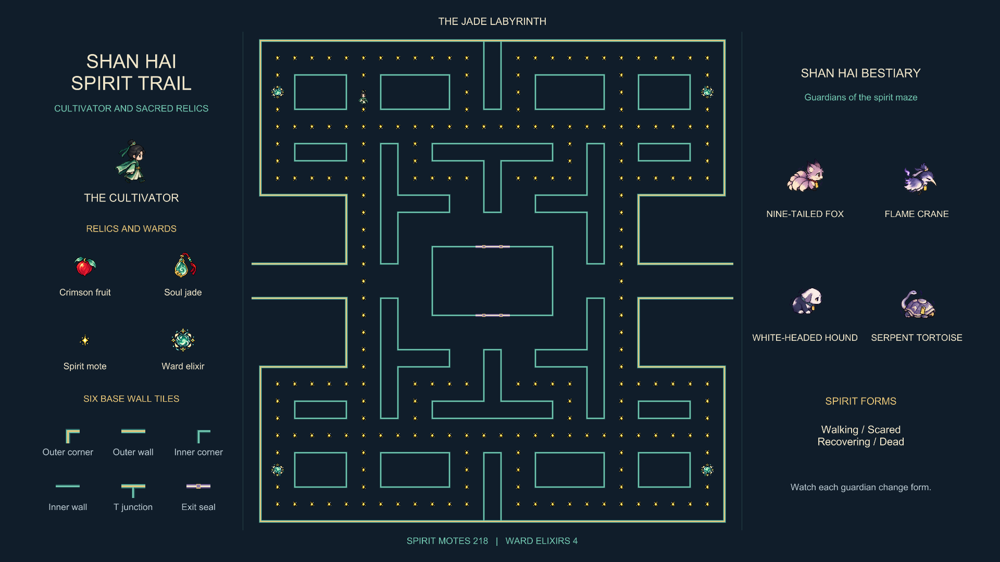

# Shan Hai Spirit Trail

31263 / 32004 Introduction to Game Development, Assessment 3.

A 2D PacStudent recreation featuring a cultivator in jade robes and mythical beasts
inspired by the Classic of Mountains and Seas. Spirit collection, ward-breaking elixirs,
and sealing rituals reinterpret the original interactions while preserving the required
level and movement rules.

## Project status

The target is **100% HD**, progressing through every grading band in order.
The Unity project foundation and the audio implementation are ready. Eleven synthesized
audio clips are imported, and the scene plays its intro before looping normal-state music.
See the audio validation record for the checks performed and listening-review limits.
The visual stage now includes 101 sprite frames, 46 visual animation clips, six visual
controllers, and a scene showcase with fifteen reusable sprite prefabs. Two full Play
sessions verified every required animation state and the existing music sequence.
The manual level is now saved in the scene: 28 columns by 29 rows, four reflected quadrants,
660 placed objects, 218 spirit motes and four animated elixirs. Two full Play sessions
verified the completed maze, retained animation showcase and music restart.
The cultivator now patrols the first inner block clockwise at 2.5 units per second,
with immediate directional animation and continuous movement audio. Real Play tests at
30, 60 and 144 requested FPS verified a 7.2-second lap and pause/resume behavior.
The generator now recreates the maze at runtime using neighboring wall connections,
four reflected quadrants and adaptive camera/showcase placement. Five maps and twenty
map/aspect combinations passed Play validation. The saved manual scene returns after Stop.
Final technical validation includes a successful Windows build, a 35-second player
launch check and five-map Play verification from a ZIP extracted without caches.
See [final validation](Documentation/FinalValidation/Final-Validation.md) and the
[submission guide](Documentation/FinalValidation/Submission-Guide.md).
The release archive is named `26151833_Assess3.zip`; its adjacent validation receipt
records the exact Main commit, ZIP checksum and final extracted-archive checks.

- Unity: **6000.4.11f1**, confirmed by the user.
- Remote: [Assessment-3---Starting-Game-Recreation](https://github.com/guohongying31-cyber/Assessment-3---Starting-Game-Recreation).
- Development branch: `Development`; work on one feature branch at a time.
- Main branch: `Main`; do not merge development work into it before final validation.
- Language: all project files, filenames, comments, asset labels, and game text use English.

## Documentation

- [Assessment requirements and acceptance checklist](Documentation/Assessment-Checklist.md)
- [Theme and asset design guidance](Documentation/Theme-Brief.md)
- [Development milestones](Documentation/Development-Plan.md)
- [Environment and validation record](Documentation/Validation.md)
- [Audio inventory and provenance](Documentation/Audio/Audio-Provenance.md)
- [Scene audio setup and playback instructions](Documentation/Audio/Scene-Audio-Guide.md)
- [Audio validation record](Documentation/Audio/Audio-Validation.md)
- [Visual production and import settings](Documentation/Visual/Visual-Production.md)
- [Animation controls and showcase guide](Documentation/Visual/Animation-Guide.md)
- [Visual validation record](Documentation/Visual/Visual-Validation.md)
- [Manual maze layout and scene guide](Documentation/ManualLevel/Manual-Level-Guide.md)
- [Manual level validation record](Documentation/ManualLevel/Manual-Level-Validation.md)
- [Patrol controls and tween explanation](Documentation/Movement/Movement-Guide.md)
- [Movement and frame-rate validation](Documentation/Movement/Movement-Validation.md)
- [Generator array, wall rules and camera controls](Documentation/LevelGenerator/Generator-Guide.md)
- [Generator validation and replacement-map evidence](Documentation/LevelGenerator/Generator-Validation.md)
- [Visual clarity improvements and before/after captures](Documentation/VisualClarity/Clarity-Validation.md)
- [Final build, clean-project and repository validation](Documentation/FinalValidation/Final-Validation.md)
- [Submission and opening instructions](Documentation/FinalValidation/Submission-Guide.md)

Production notes describe the actual assets and configuration. Validation records
distinguish completed checks from work that remains unfinished.

## Open the project

Add this directory in Unity Hub and open it with version 6000.4.11f1.
Open `Assets/Scenes/RecreatedLevel.unity`.
The scene contains an orthographic camera and four organizational groups:
`Systems`, `Level01_Manual`, `Characters`, and `AssetShowcase`.
`Systems/LevelAudio` plays the 2.4-second intro and then loops the normal music.
`Level01_Manual` contains the four saved maze quadrants, visible before Play.
`Systems/LevelGenerator` replaces them with `Level01_Generated` during Play. Editing
the `levelMap` array in `Assets/Scripts/Level/LevelGenerator.cs` changes the runtime
layout; camera framing, panel placement and inventory labels adapt to its dimensions.
`AssetShowcase` displays the cultivator, four beasts, four items and six wall samples in
panels beside the maze in landscape and below it in portrait. Press Play and watch
for at least 28 seconds to see every character
state and a full normal-music loop. Four maze elixirs and the sidebar elixir pulse.
`Characters/PacStudent` patrols the maze's first upper-left inner block. Its four-way
walking animation matches each turn and soft steps loop while it moves. Stop and Play
again to restart the patrol, preview and music. Movement is automatic; this stage has
no keyboard control, collision response or pickup collection.

## Git and submission

Commit each completed, reviewable milestone separately. Create every feature branch
from the latest `Development`, test it, merge it back, and retain the feature branch.
Only after final validation should Development merge into `Main`.
Package the project as `26151833_Assess3.zip`, including `.git` and
`.gitignore` and excluding `Library`.

The `.gitignore` is based on the assessment-specified
[GitHub Unity template](https://github.com/github/gitignore/blob/main/Unity.gitignore),
with additional rules for local references and temporary verification files.
