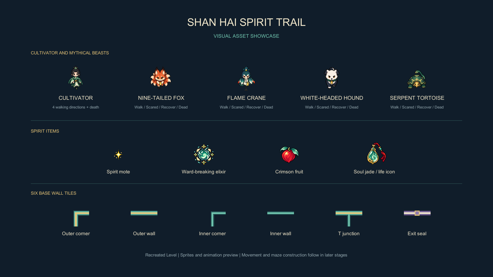

# Shan Hai Spirit Trail

31263 / 32004 Introduction to Game Development, Assessment 3.

A 2D PacStudent recreation featuring a cultivator in jade robes and mythical beasts
inspired by the Classic of Mountains and Seas. Spirit collection, ward-breaking elixirs,
and sealing rituals reinterpret the original interactions while preserving the required
level and movement rules.

## Current stage

The target is **100% HD**, progressing through every grading band in order.
The Unity project foundation and the audio implementation are ready. Eleven synthesized
audio clips are imported, and the scene plays its intro before looping normal-state music.
See the audio validation record for the checks performed and listening-review limits.
The visual stage now includes 101 sprite frames, 46 visual animation clips, six visual
controllers, and a scene showcase with fifteen reusable sprite prefabs. Two full Play
sessions verified every required animation state and the existing music sequence.
The next stage is `Feature-ManualLevel`, followed by movement and procedural generation.
Those three features remain unfinished. This project is not ready for assessment submission.

- Unity: **6000.4.11f1**, confirmed by the user.
- Remote: [Assessment-3---Starting-Game-Recreation](https://github.com/guohongying31-cyber/Assessment-3---Starting-Game-Recreation).
- Development branch: `Development`; work on one feature branch at a time.
- Main branch: `Main`; do not merge development work into it before final validation.
- Language: all project files, filenames, comments, asset labels, and game text use English.

## Documentation

- [Assessment requirements and acceptance checklist](Documentation/Assessment-Checklist.md)
- [Theme and asset design guidance](Documentation/Theme-Brief.md)
- [Development milestones](Documentation/Development-Plan.md)
- [Environment and validation record](Documentation/Validation.md)
- [Audio inventory and provenance](Documentation/Audio/Audio-Provenance.md)
- [Scene audio setup and playback instructions](Documentation/Audio/Scene-Audio-Guide.md)
- [Audio validation record](Documentation/Audio/Audio-Validation.md)
- [Visual production and import settings](Documentation/Visual/Visual-Production.md)
- [Animation controls and showcase guide](Documentation/Visual/Animation-Guide.md)
- [Visual validation record](Documentation/Visual/Visual-Validation.md)

Production notes describe the actual assets and configuration. Validation records
distinguish completed checks from work that remains unfinished.

## Open the project

Add this directory in Unity Hub and open it with version 6000.4.11f1.
Open `Assets/Scenes/RecreatedLevel.unity`.
The scene contains an orthographic camera and four organizational groups:
`Systems`, `Level01_Manual`, `Characters`, and `AssetShowcase`.
`Systems/LevelAudio` plays the 2.4-second intro and then loops the normal music.
`AssetShowcase` displays the cultivator, four beasts, four items and six wall samples.
Press Play and watch for at least 21 seconds to see every character animation state.
The elixir pulses continuously. Stop and Play again to restart the preview and music.
`Level01_Manual` and the separate gameplay `Characters` group are reserved for later work.

## Git and submission

Commit each completed, reviewable milestone separately. Create every feature branch
from the latest `Development`, test it, merge it back, and retain the feature branch.
Only after final validation should Development merge into `Main`.
Package the project as `studentNumber_Assess3.zip`, including `.git` and
`.gitignore` and excluding `Library`.

The `.gitignore` is based on the assessment-specified
[GitHub Unity template](https://github.com/github/gitignore/blob/main/Unity.gitignore),
with additional rules for local references and temporary verification files.
